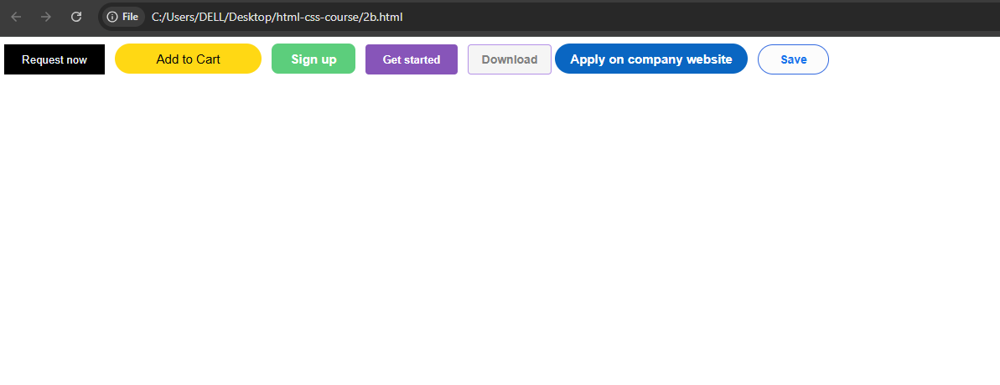
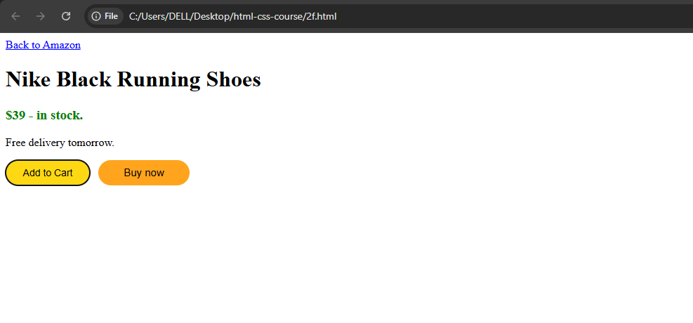
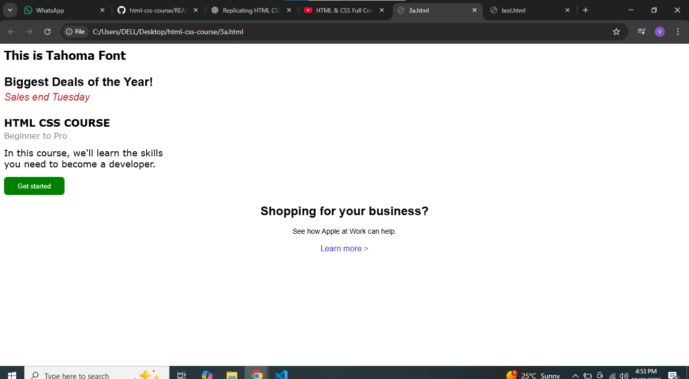
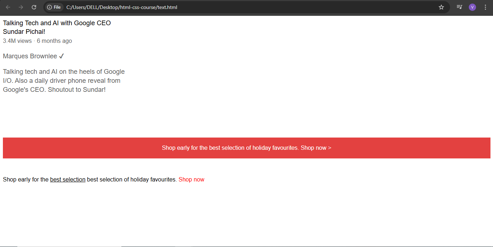

# HTML CSS Course

This repository contains my practice projects while learning HTML and CSS.  
It includes buttons, UI components, and small webpage layouts to experiment with styling, hover effects, and basic interactivity.

## Projects included
- `2b.html` → Multi-purpose buttons with hover and active effects:
  - Uber: Request now
  - Amazon: Add to Cart
  - GitHub: Sign up
  - Bootstrap: Get started & Download
  - LinkedIn: Apply on company site & Save  
  

- `2f.html` → Headers practice with color and links  
  

- Other HTML files → Various small practice projects  
  
  
